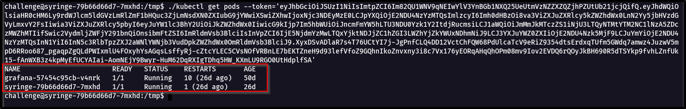

# Reconnaissance

## Network Scanning

### Port 22
  
Discover port 22 with OpenSSH 8.2p1 Ubuntu 4ubuntu0.3 (Ubuntu Linux; protocol 2.0)  

### Port 80
  
Discover port 80 is opened. Nmap script dint show any version or banner info about the services.  

## Website Enumeration

### Ping Command Output
  
Insert localhost as the input in the provided field. We can see that a ping cmd is execute as the output show. We can try bypass it by inject '|' into it.  

### List Directory
  
Discovered command injection flaw. We can see that the ls cmd is executed success and the backend system show the current directory.  

# Initial Foothold
  
We get revese shell gain into the boxes.  

## Environmental Flag
  
Since we get shell, now we can get the flag in the environment variable as the hint given.  

## Kubectl Enumeration

> **kubectl** is a API that can use to interact with the cluster.

### List Pods
  
We try to list pods. But we get error and tell us that current service account user don’t have related privileges.  

### Privileges Right
  
Check permissions. Discover that we can list secrets resources.  

### List Secret
  
List all kubernetes secretes. Discover secretflag.  

### Get Secret
  
Read specific secret and obtain flag2  

### Grafana Services
  
List environment variables to check for kubernetes related services. We discover Grafana service running in the server.  
>By default Kubernetes creates environment variables containing the host and port of the other services running in the cluster  
Also we can discover the Grafana host IP is in 10.108.133.228.  

## Grafana Enumeration

### Login Page
  
Curl the IP with the port and discover the login page and the source code in HTML format.  

### Grafana Version
  
Discover grafana version. Found the [CVE](https://github.com/julesbozouklian/CVE-2021-43798) for this version.  

### Passwd File
  
Manually do the POC exploit and try to grab /etc/passwd file. We successful grab the file.  

## Kubernetes Services Token Enumeration

### Services Account Token
  
> Kubernetes stores the token of the service account running a pod in /var/run/secrets/kubernetes.io/serviceaccount/token 
Obtain the token from the grafana pods  

### Token Privileges
  
Check the TOKEN service account privileges. Discover that the token's service account can do all the verbs in all the resources. Which mean this is a 'cluster-admin' service account.  

### List pods
  
List all the pods again. We discover the node contain 2 pod are running. Please note that 'syringe-79b66d66d7-7mxhd' is current pod we are in via the reverse shell.  

### Shell in Grafana pod
  
Get shell into the Grafana pod.  

### Grafana pod Environment Variables
  
Obtain flag on Grafana pod  

## Escape Node

### Evil Yaml
  
Transfer the bad pod config yaml file into the syringe pod  

### Create Evil Pod
  
Create the evil-pod with the evil-yaml.  

### Check created pod
  
Check the pod is being created  

# Privilege Escalation

## Shell in evil-pod
  
Get shell into the fully privileges evil-pod.  

## Root flag
  
Obtain the last flag  