# Network Mapping
Port 22 with OpenSSH services

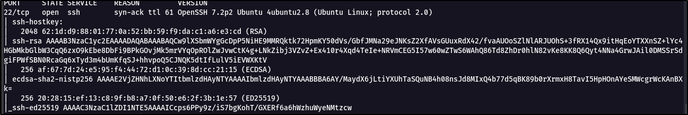

Port 25 with Postfix email services

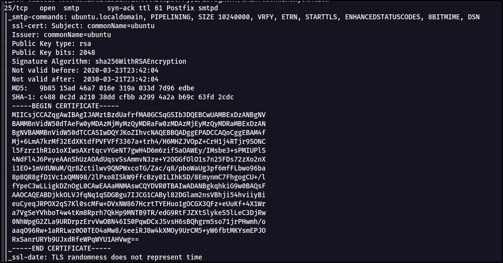

Port 80 and Port 443 with  Apache webserver

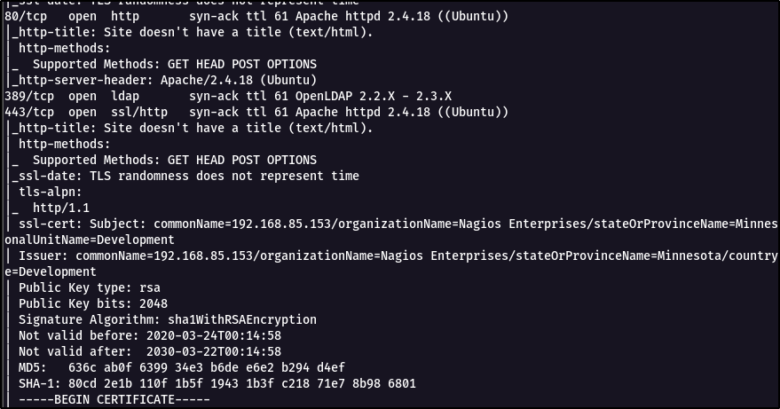

# Website Access
Main page of the website. Nothing special on the page.

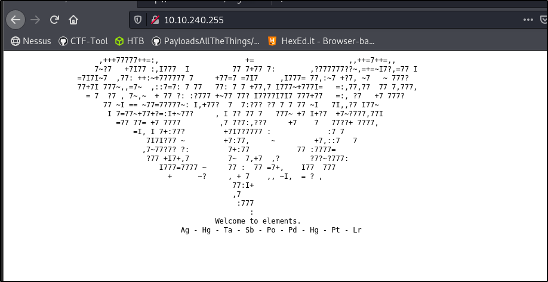

Checking on the source code.
Discovered '/nagiosxi' directory and some text related element periodic table

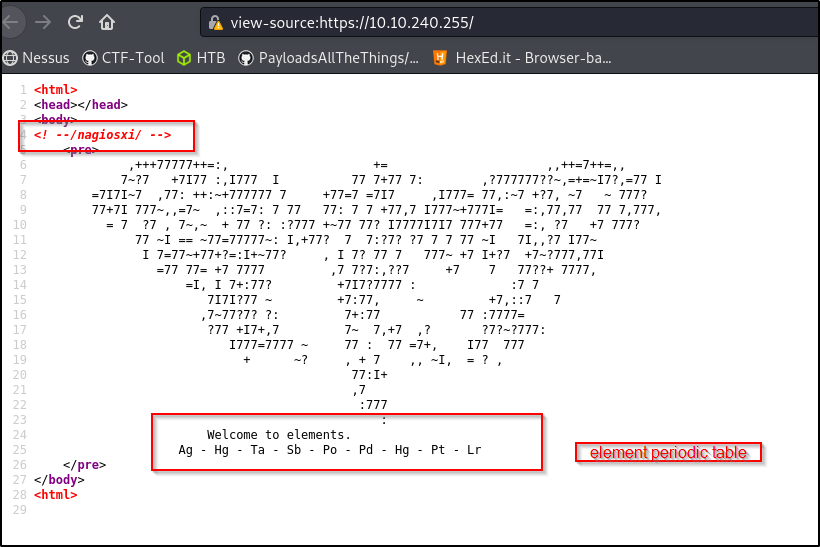

Accessed into the '/nagiosxi' directory and discovered a login page.

Tested with nagiosxi default credentials, but failed to login.

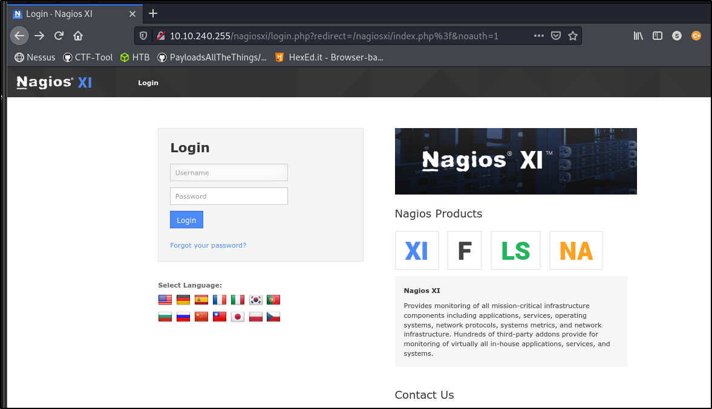

Since, do not have any valid credentials for login. Put aside on this section.
Google about the element text on the main page.

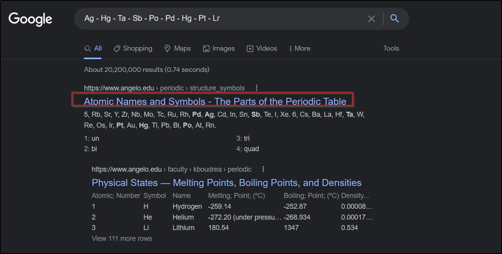

# Decode 
Refer to below table to decode the element number.
https://www.angelo.edu/faculty/kboudrea/periodic/structure_symbols.htm
	
Ag - Hg - Ta - Sb - Po - Pd - Hg - Pt - Lr  ---> Element symbol
	
47 - 80 - 73 - 51 - 84 - 46 - 80 - 78 - 103   ---> ASCII CODE (Refer table)

Next, convert the ASCII to text with python chr() function. 
Extracted the text as below

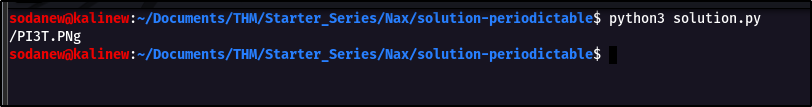

# PIET
Access to the '/PI3T.png' page. Found out an image. 
Download it with wget command

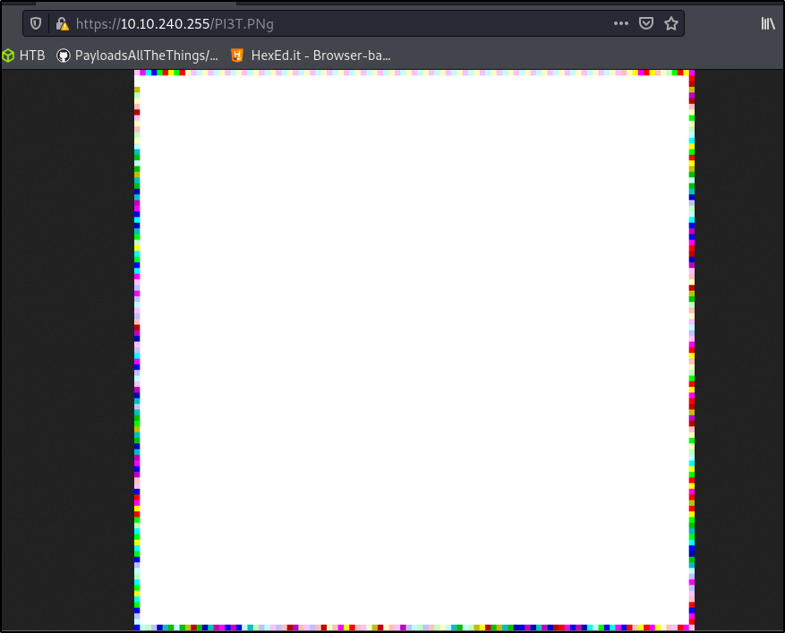

Examine the image. Creator discovered. Answer for question 2

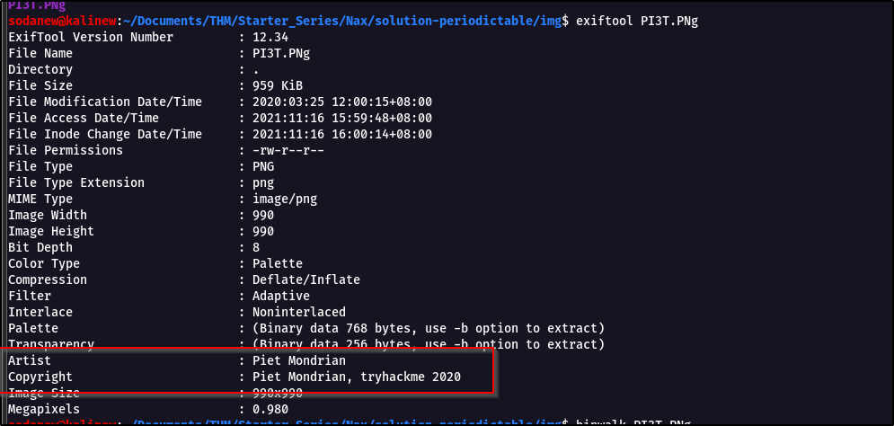

Since this is stego challenge, use online source from the below link.
https://0xrick.github.io/lists/stego/ 
From the web tools in the list. Npiet online tool to extract valid credentials.

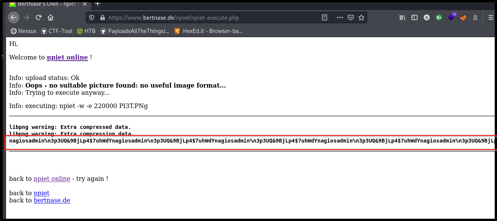

Extracted part: nagiosadmin:n3p3UQ&9BjLp4$7uhWdY
Answer for question 4 and 5.

# Root
Login with the valid credential. 

Discover the version for NagiosXI is 5.5.6.

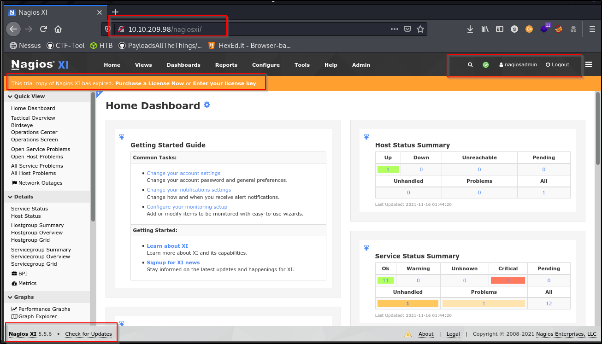

Google the specific version of the exploit and lead below link

https://www.exploit-db.com/exploits/48191

Config for the exploit and execute it.

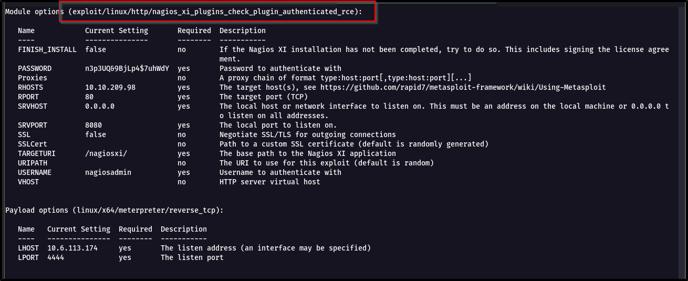

Root access granted with the exploit.

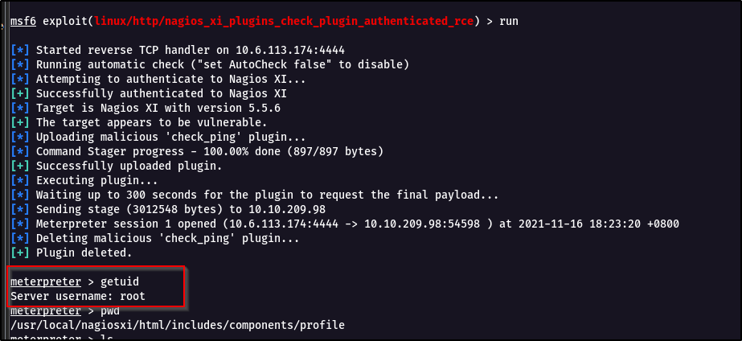

Answer for the question 6-10.

Thank you for your reading.
